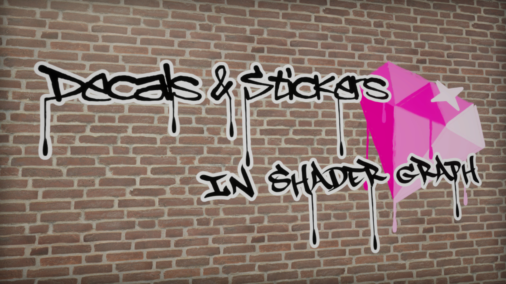

# Decals & Stickers in Unity Shader Graph and URP

A decal effect made using Shader Graph in URP.

## Overview

This repository features a decal effect in URP which uses Shader Graph. While there are certainly more efficient ways to render decals (since this approach requires a matrix transformation in the fragment shader - eww), this was a great effect to make! The method was to project a texture along a cube volume, using object space and the depth buffer to paint the texture on the cube surface with the correct perspective as if the texture was painted on the intersections between the cube and the wall.

## Software

This project was created using Unity 2020.3.2f1 and Universal Render Pipeline 10.4.0.

## Authors

This project and the corresponding tutorial was created by Daniel Ilett.

## Release

This project was publically released on September 26th 2021.
